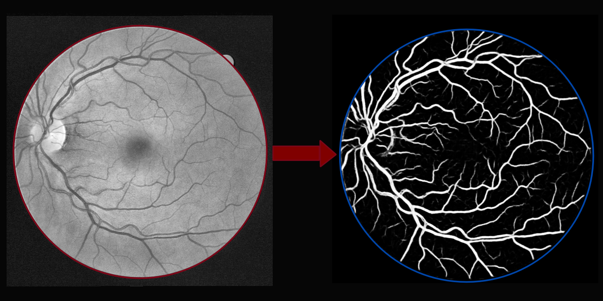
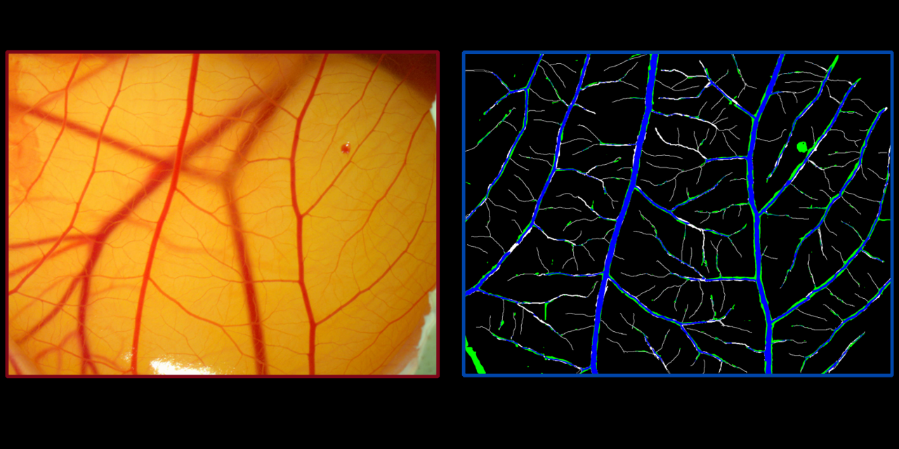

# Blood Vessel Segmentation for Retina and Chicken Eggs (WIP)

Cancer cells grow randomly and fast creating blood vessels to capture more nutrients from the organism. Some drugs have an interesting behavior of constricting blood vessels preventing blood from circulating, these drugs can be applied to cancer cells to prevent them from receiving nutrients, which leads to cancer death. In the University Federal of Minas Gerais (UFMG) these drugs' effects are studied on chicken eggs' blood vessels, where pictures of the blood vessels are taken before and after the application of the drug. By comparing these two pictures it is possible to measure the blood vessel's growth or shrinkage. To enable this type of study, it is necessary to segment all the blood vessels from a set of images before any analysis can be done.

The main problem with vessel segmentation is that the process takes a lot of time to be made manually, and algorithms automatization such as the [ImageJ][imagej] are not accurate and require a lot of human interference. This project aims to guarantee reliable results with less to no human interference in blood vessel segmentation. The main idea is to use algorithms that are already known to work for retina blood vessel segmentation in our chicken eggs image dataset; this will ensure more accurate segmentation than obtained with [ImageJ][imagej] while giving more flexibility to adapt the algorithm to our needs.

Although it seems arduous to build our dataset from scratch, mainly because of the need to label all vessels manually, we showed that accurate results are obtained even using only a few images, five to be more precise. The results of the segmentation of the retina fundus eye and from chicken eggs are presented below, the latter is a work in progress.

|:--:| 
| *Segmentation of Blood Vessels from Eye Fundus* |
Segmentation obtained using a simple U-net.

|:--:| 
| *Segmentation of Blood Vessels from Chicken Eggs* |
Notice that there is some blood vessel in the background that should be ignored by the algorithm.

Labels:
- White: Segmentation made by hand. (Ground Truth)
- Blue: Correct segmentation predicted by the algorithm. (True Postiive)
- Green: Incorrect segmentation predicted by the algorithm. (False Positive)

## Future implementations:

- [ ] Get better labels for image segmentation.
- [ ] Obfuscate background blood vessels.
- [ ] To imporove segmentation of tiny vessels, we can split the vessels into different classes based on their diameter and change the loss to focal loss.
- [ ] Define what will be measured after the segmentation.  

## Prerequisites:

See the docker file.

## Authors
[Ronaldo](https://www.linkedin.com/in/ronaldo-givisiez/)

[Thomas](http://linkedin.com/in/thomas-toshio-inoue-5240241b5)

imagej:https://imagej.nih.gov/ij/
